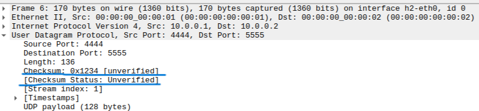
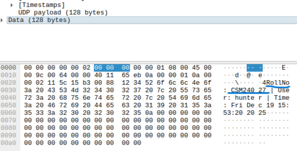

Q) Standard OS networking stacks manage protocol headers automatically. In this task, you will bypass the stack to manually "forge" a packet with intentional errors to observe how network layers respond to corruption. Create a C raw socket program to:
Manually construct the Ethernet Header, IP Header, and UDP Header.
You must deliberately calculate an incorrect UDP checksum and inject it into the header.
The payload must contain your Roll Number and the current system username and time.
Setup a topology with two hosts (h1,h2) and a single switch. Execute your script from h1 targeting h2.
Use Wireshark on h2 to capture the incoming frame.

