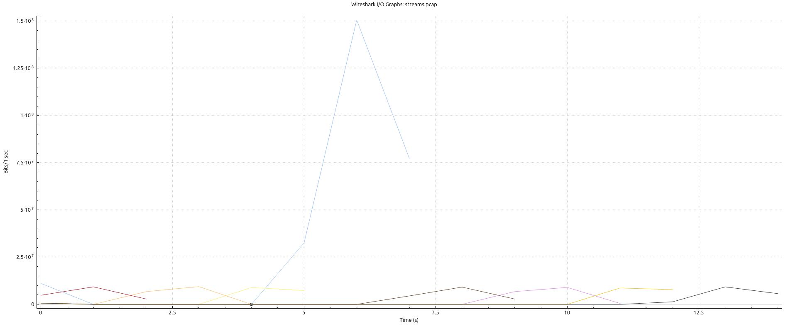

Q2: Network performance fluctuates under congestion. You are required to analyze how multiple concurrent TCP streams compete for bandwidth on a mininet link.
Write a Mininet script to connect two hosts with links having bandwidth: 10mbps.
TCP server h1 that accepts multiple connections and logs the size of every received chunk along with a high-resolution timestamp (microsecond precision.
h2 creates 8 concurrent threads. Each thread must attempt to transmit a 2MB unique buffer to the server simultaneously.
Generate a Wireshark IO Graph showing the throughput of all 8 streams.

