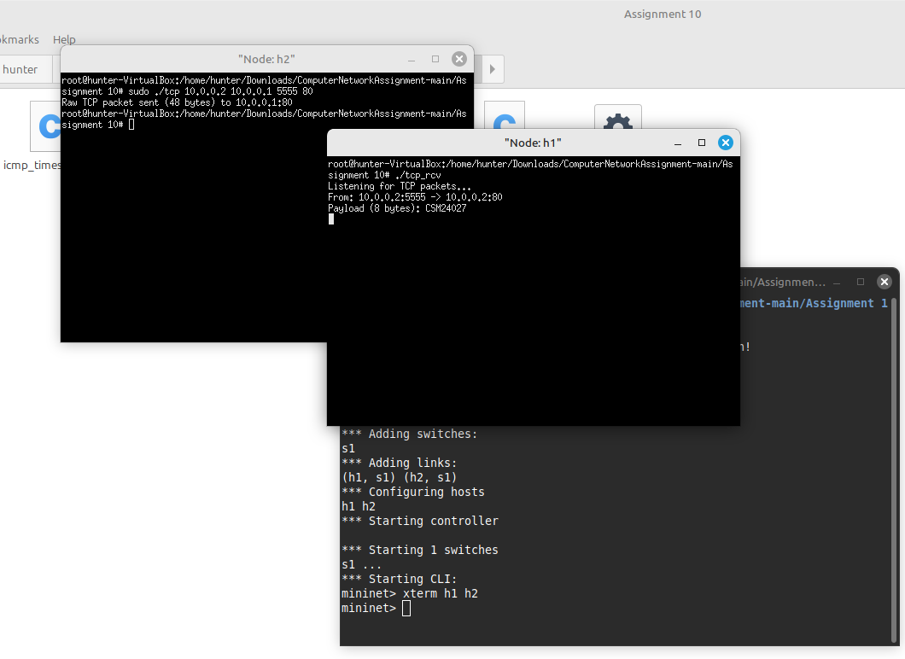

Assignment 10:

Objective:
Using RAW sockets to generate packets.

Exercise:
i. Write two C programs using raw socket to send i. TCP packet where TCP payload
   will contain your roll number. 
ii. ICMP time stamp messages towards a target IP.

