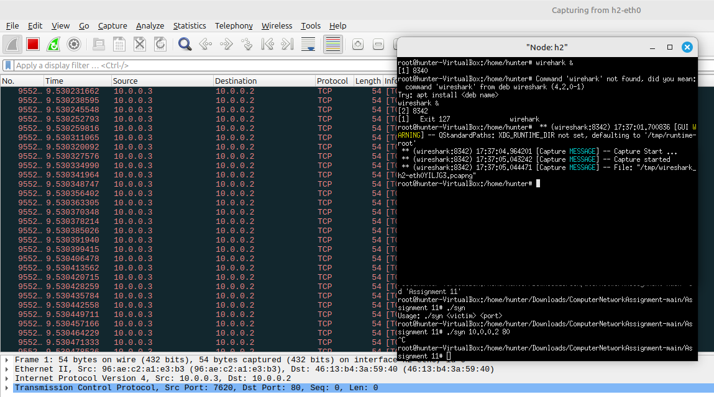

Assignment 11:

Objective:
Using RAW sockets to generate TCP flooding attack.

Exercise:
Write a RAW socket program to generate TCP SYN flood based DDoS attack
towards an IP address. Take four mininet hosts as agent devices.

