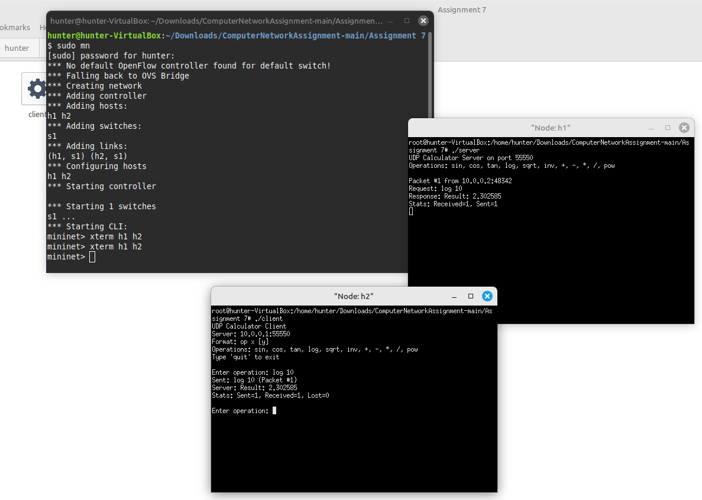

Assignment 7:
Objective:
Client server communication with UDP packets
Exercise:
Write UDP client server socket program where client sends one/two number(s)
(integer or floating point) to server and a scientific calculator operation (like
sin,cos,*,/, inv etc.) and server responds with the result after evaluating the value of
operation as sent by the client. Server will maintain a scientific calculator. Detect in
the mininet hosts with wireshark if there is any packet loss?

