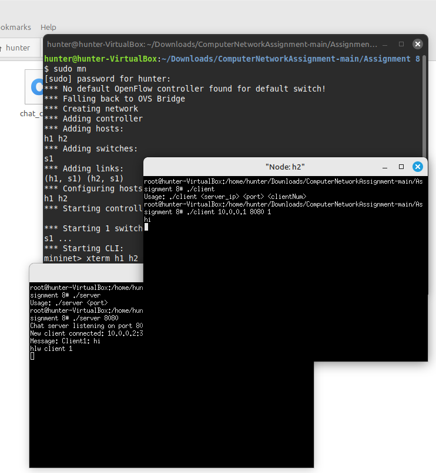

Assignment 8:
Objective:
Using Thread library and TCP sockets.
Exercise:
Write a program in C using thread library and TCP sockets to build a chat server
which enable clients communicating to each other through the chat server. Message
logs must be maintained in the server in a text file. Each client will see the
conversations in real time. Clients must handled by a server thread

