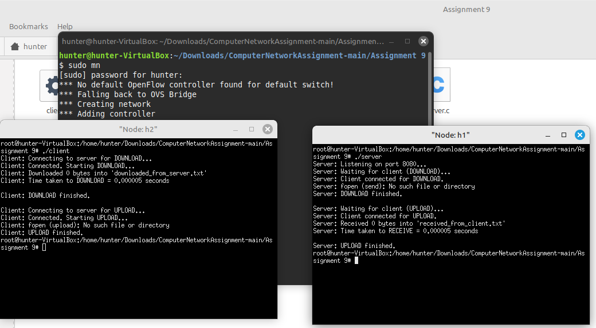

Assignment 9:
Objective:
File upload and download using TCP.
Exercise:
Write a client server socket program in TCP for uploading and downloading files
between two different hosts. Also calculate the transfer time in both the cases.

